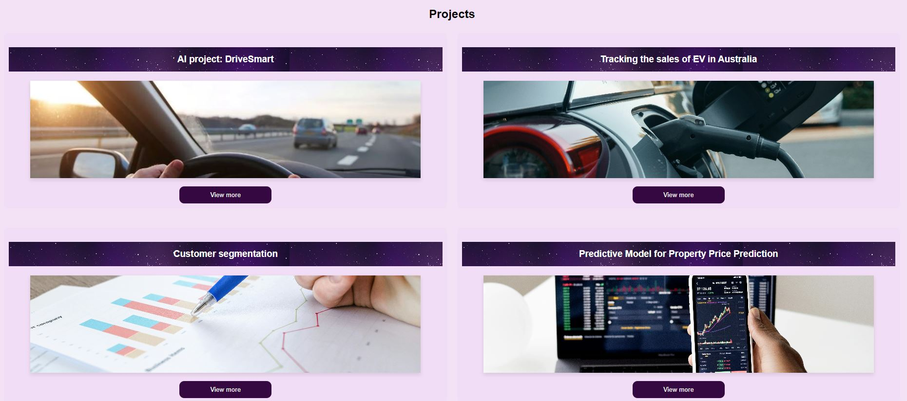

# 🌟Module 2 challenge 🌟

## Project Overview

This project aims to develop a codebase for my personal portfolio, showcasing various projects that I have worked on. The portfolio will serve as a comprehensive presentation of my skills, experience, and accomplishments. By ensuring compliance with web development standards, the website will be optimized for search engines (SEO), enhancing its visibility and providing an improved user experience. The portfolio will feature a clean, responsive design that is accessible across different devices and screen sizes.

## Key Features  
**Responsive Design:** The portfolio will be fully responsive, ensuring that it looks great on desktops, tablets, and mobile devices. 
**SEO Optimization:** Implementation of best SEO practices to improve search engine rankings and visibility. 
**Project Showcase:** A dedicated section for each project with descriptions, screenshots, and links to the live projects or repositories. 
**Contact Information:** An easy way for visitors to get in touch with me. 
**Modern Technologies:** Utilization of modern web technologies and frameworks to create a fast and efficient site. 

## Technologies Used 
**HTML:** For structuring the content of the portfolio. 
**CSS:** For styling the content and ensuring a visually appealing layout. 

## Goals and Objectives  
**Professional Presentation:** Create a polished, professional online presence that accurately represents my skills and projects.  
**User-Friendly Navigation:** Ensure that visitors can easily navigate through the portfolio and find the information they are looking for.  
**Performance Optimization:** Optimize the website for fast loading times and smooth performance. 

## ScreenShot
This is a quick glimpse of what the final output will look like.

## Link to the website
https://tinaika19.github.io/Portfolio/
